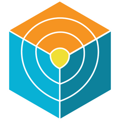

# DevSecOps 3-Tier Application on AWS EKS with GitOps
Production-ready DevOps infrastructure implementing modern cloud-native practices with automated CI/CD pipelines on AWS EKS. The platform integrates Terraform for Infrastructure as Code, Jenkins for continuous integration, ArgoCD for GitOps delivery, and comprehensive monitoring with Prometheus/Grafana. Features enterprise-grade security scanning, automated quality gates, and zero-downtime deployment strategies for scalable application delivery. Demonstrates advanced DevOps engineering capabilities with full automation from code commit to production deployment.
> Complete DevOps infrastructure with AWS EKS, Jenkins CI/CD, ArgoCD GitOps, and monitoring stack for automated application delivery.

  
  

<h3 align="center">AWS Services Used</h3>

  
  
  
  
  
  
  
  
  

<h3 align="center">Tools & Technologies Used </h3>

<!-- Row 2 -->

  
  
  
  
  
  
  

<!-- Row 3 -->

  
  
  
  
  
  
  
  

## Infrastructure
| Component   | Technology             | Configuration                                    | Access                                   |
|-------------|------------------------|--------------------------------------------------|------------------------------------------|
| Kubernetes  | Amazon EKS              | 2x t2.medium nodes, ap-south-1                    | kubectl configured                       |
| CI/CD       | Jenkins on EC2          | Docker, kubectl, AWS CLI, SonarCube              | :8080                                    |
| GitOps      | ArgoCD                  | 5 applications, auto-sync enabled                | LoadBalancer                             |
| Monitoring  | Prometheus + Grafana    | Helm deployed, Dashboard                 | :9090, :3000                             |
| Registry    | AWS ECR                 | frontend/backend repositories                    | IAM authenticated                        |
| Storage     | S3 + DynamoDB           | Terraform state + locking                        | Backend configured                       |
| DNS         | Route 53                | Custom domain routing                            | online.com, api.online.com       |
| Security    | SonarCube + OWASP       | Code quality + dependency scanning               | :9000                                    |

## Application Stack & Deployment
| Layer      | Component     | Technology                    | Deployment                | Status      |
|------------|--------------|--------------------------------|---------------------------|-------------|
| Frontend   | Web App       | React (Port 3000)              | ArgoCD → EKS               | Auto-sync   |
| Backend    | API Server    | Django REST (Port 8000)        | ArgoCD → EKS               | Auto-sync   |
| Database   | Data Layer    | PostgreSQL (Port 5432)         | ArgoCD → EKS               | Auto-sync   |
| Ingress    | Load Balancer | AWS ALB Controller             | Frontend + Backend routes  | Active      |
| Namespaces | Organization  | three-tier, argocd, monitoring | Kubernetes separation      | Configured  |
| Images     | Containers    | Docker → ECR repositories      | Jenkins builds             | Automated   |
| Secrets    | Credentials   | K8s secrets + Jenkins store    | 7 configured credentials   | Secured     |

## CI/CD Pipeline
| Stage   | Process         | Backend Pipeline                         | Frontend Pipeline                  |
|---------|----------------|------------------------------------------|-------------------------------------|
| Setup   | Infrastructure | `terraform init && apply`                | Configure AWS credentials          |
| Source  | Code Checkout  | Git → Jenkins trigger                     | Git → Jenkins trigger               |
| Quality | Code Analysis  | SonarCube scan + OWASP check              | SonarCube scan + OWASP check        |
| Build   | Containerization | Docker build → ECR push                  | Docker build → ECR push             |
| Deploy  | GitOps Sync    | ArgoCD detects → K8s deploy               | ArgoCD detects → K8s deploy         |
| Access  | Endpoints      | `api.online.com`                      | `online.com`                    |
| Monitor | Observability  | Prometheus metrics                        | Grafana dashboards                  |

## Architecture Diagram

  

## Author

Noufa Sunkesula

Contact: +91 8106859686

Mail ID: noufasunkesula@gmail.com

